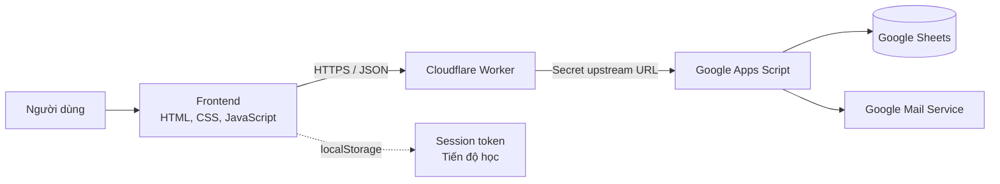

# VocaNest

> Ứng dụng web học từ vựng và ngữ pháp TOEIC, được xây dựng bằng JavaScript thuần, Google Apps Script, Google Sheets và Cloudflare Workers.

[](https://ptlocnguyen.github.io/VocaNest/)
[](https://workers.cloudflare.com/)
[](https://developer.mozilla.org/docs/Web/JavaScript)

**Demo trực tuyến:** [ptlocnguyen.github.io/VocaNest](https://ptlocnguyen.github.io/VocaNest/)

## Giới thiệu

VocaNest là một dự án full-stack serverless tập trung vào trải nghiệm tự học tiếng Anh. Người dùng có thể xây dựng thư viện từ vựng riêng, chia sẻ bộ từ công khai, import dữ liệu từ Excel, luyện flashcards có phát âm và ôn hệ thống ngữ pháp TOEIC từ cơ bản đến nâng cao.

Dự án ban đầu sử dụng Supabase, sau đó được thiết kế lại để vận hành trên hệ sinh thái Google Drive:

- **Google Sheets** đóng vai trò kho dữ liệu có cấu trúc.
- **Google Apps Script** xử lý xác thực và nghiệp vụ backend.
- **Cloudflare Worker** bảo vệ URL Apps Script, kiểm soát CORS và làm API proxy.
- **GitHub Pages** phục vụ frontend tĩnh.

Kiến trúc này giúp dự án có chi phí vận hành thấp, dễ triển khai và phù hợp cho portfolio, ứng dụng cá nhân, lớp học nhỏ hoặc sản phẩm MVP.

## Tính năng

### Tài khoản và bảo mật

- Đăng ký, đăng nhập và đăng xuất.
- Phiên đăng nhập có thời hạn 14 ngày.
- Đổi mật khẩu trong trang tài khoản.
- Quên mật khẩu và gửi liên kết đặt lại qua email.
- Mật khẩu được băm kèm salt trước khi lưu.
- Cache phiên đăng nhập tại Apps Script để giảm số lần đọc Google Sheets.
- Route guard bảo vệ các trang yêu cầu đăng nhập.

### Quản lý từ vựng

- Tạo và xóa bộ từ vựng cá nhân.
- Chọn trạng thái riêng tư hoặc công khai.
- Khám phá bộ từ công khai của người dùng khác.
- Thêm, tìm kiếm và xóa từng từ.
- Import hàng loạt từ file Excel `.xlsx` hoặc `.xls`.
- Phân quyền chủ sở hữu: người xem bộ công khai không thể sửa dữ liệu.

### Flashcards

- Lật thẻ bằng chuột, cảm ứng hoặc bàn phím.
- Chuyển thẻ trước/sau và hiển thị tiến độ.
- Xáo trộn thứ tự học.
- Phát âm tiếng Anh bằng Web Speech API.
- Điều chỉnh tốc độ đọc và bật tự động phát âm.
- Đánh dấu từ khó hoặc từ đã nhớ.
- Điều hướng bằng thao tác vuốt và các phím tắt bàn phím.
- Lưu trạng thái học cục bộ trên trình duyệt.

### Ngữ pháp TOEIC

- **42 chuyên đề** từ cơ bản đến nâng cao.
- Nội dung phục vụ TOEIC Reading Part 5, Part 6 và Part 7.
- Mỗi chuyên đề có công thức, cách dùng, dấu hiệu nhận biết, ví dụ và bẫy thường gặp.
- Tìm kiếm không dấu và lọc theo cấp độ hoặc chủ điểm.
- Mở/thu gọn toàn bộ nội dung.
- Đánh dấu chuyên đề đã học và theo dõi tiến độ.

### Trải nghiệm người dùng

- Giao diện responsive cho desktop, tablet và mobile.
- Chế độ sáng/tối mặc định theo thiết bị và ghi nhớ lựa chọn của người dùng.
- Hai bảng màu sáng/tối đồng nhất, tối ưu cho thời gian học dài.
- Hỗ trợ thao tác bàn phím và trạng thái focus rõ ràng.
- Tìm kiếm có debounce để hạn chế render không cần thiết.
- Tôn trọng thiết lập `prefers-reduced-motion`.

## Kiến trúc hệ thống



### Luồng request

1. Frontend gửi một request `POST` tới Cloudflare Worker.
2. Worker kiểm tra origin, method, kích thước body và cấu trúc JSON.
3. Worker chuyển tiếp request tới URL Apps Script được lưu bằng Cloudflare Secret.
4. Apps Script xác thực session, xử lý nghiệp vụ và đọc/ghi Google Sheets.
5. Kết quả JSON được trả về frontend qua Worker.

URL Apps Script không xuất hiện trong mã nguồn frontend hoặc repository công khai.

## Công nghệ sử dụng

| Thành phần | Công nghệ | Vai trò |
|---|---|---|
| Frontend | HTML5, CSS3, Vanilla JavaScript | Giao diện và nghiệp vụ phía trình duyệt |
| UI icons | Lucide | Hệ thống biểu tượng |
| Excel parser | SheetJS | Đọc file `.xlsx` và `.xls` |
| Text-to-Speech | Web Speech API | Phát âm từ tiếng Anh |
| API proxy | Cloudflare Workers | CORS, validation và che URL upstream |
| Backend | Google Apps Script | Xác thực, phân quyền và CRUD |
| Database | Google Sheets | Lưu người dùng, bộ từ và từ vựng |
| Email | Apps Script MailApp | Gửi liên kết đặt lại mật khẩu |
| Hosting | GitHub Pages | Triển khai frontend tĩnh |

## Thiết kế dữ liệu

Backend tự khởi tạo bốn sheet:

| Sheet | Nội dung chính |
|---|---|
| `users` | Tài khoản, password hash, salt và session |
| `vocab_sets` | Thông tin bộ từ, chủ sở hữu và quyền công khai |
| `vocab_items` | Từ, nghĩa và liên kết tới bộ từ |
| `password_resets` | Token đặt lại mật khẩu, thời hạn và trạng thái sử dụng |

Các bản ghi sử dụng UUID. Thao tác ghi quan trọng sử dụng `LockService` để giảm nguy cơ xung đột khi nhiều request chạy đồng thời.

## Điểm nổi bật về kỹ thuật

- Chuyển đổi toàn bộ data layer từ Supabase sang Google Sheets mà vẫn giữ trải nghiệm đăng nhập và CRUD.
- Tách URL backend khỏi frontend bằng Cloudflare Secret thay vì nhúng trực tiếp Apps Script URL.
- Thiết kế một API theo `action` để phù hợp với giới hạn của Google Apps Script Web App.
- Giảm request thừa bằng endpoint bundle, session cache và cập nhật UI theo dữ liệu trả về.
- Import Excel theo batch thay vì gửi từng từ trong nhiều request.
- Render dữ liệu động bằng `textContent` và DOM API, hạn chế đưa dữ liệu người dùng trực tiếp vào HTML.
- Phân tách CSS theo nền tảng, layout, component và từng trang để dễ bảo trì.
- Không dùng frontend framework, qua đó thể hiện rõ khả năng làm việc với DOM, state, async flow và responsive CSS.

## Cấu trúc thư mục

```text
VocaNest/
├── assets/
│   ├── css/
│   │   ├── base.css
│   │   ├── layout.css
│   │   ├── ui.css
│   │   ├── grammar.css
│   │   └── ...styles theo từng trang
│   └── js/
│       ├── apiClient.js
│       ├── authGuard.js
│       ├── grammar.js
│       ├── flashcards.js
│       └── ...logic theo từng trang
├── cloudflare-worker/
│   ├── src/index.js
│   ├── package.json
│   └── wrangler.jsonc
├── pages/
│   ├── auth.html
│   ├── home.html
│   ├── vocab-sets.html
│   ├── vocab-set-detail.html
│   ├── flashcards.html
│   ├── grammar.html
│   ├── account.html
│   ├── forgot-password.html
│   └── reset-password.html
├── index.html
└── README.md
```

> Mã nguồn Apps Script và cấu hình Google Sheet được giữ ngoài Git để không công khai thông tin triển khai backend.

## Chạy dự án ở local

### Yêu cầu

- Git.
- Một static HTTP server, ví dụ Python, VS Code Live Server hoặc Node.js.
- Kết nối Internet để sử dụng API đang deploy và tải các thư viện CDN.

### Cài đặt

```bash
git clone https://github.com/ptlocnguyen/VocaNest.git
cd VocaNest
```

Chạy bằng Python:

```bash
python -m http.server 8000
```

Mở:

```text
http://127.0.0.1:8000
```

Không nên mở trực tiếp bằng `file://`, vì một số hành vi điều hướng, request và CORS cần môi trường HTTP.

API frontend được cấu hình tại:

```text
assets/js/config.js
```

## Format file Excel

Tính năng import đọc sheet đầu tiên và hai cột đầu:

| word | meaning |
|---|---|
| schedule | lịch trình; lên lịch |
| appointment | cuộc hẹn |
| deadline | hạn chót |

Quy tắc:

- Hỗ trợ `.xlsx` và `.xls`.
- Hàng tiêu đề là tùy chọn.
- Tiêu đề cột đầu có thể là `word` hoặc `từ vựng`.
- Những hàng thiếu từ hoặc nghĩa sẽ được bỏ qua.

## Triển khai Cloudflare Worker

```bash
cd cloudflare-worker
npm install
npx wrangler login
npm run secret
npm run deploy
```

Lệnh `npm run secret` yêu cầu nhập Apps Script Web App URL và lưu dưới secret:

```text
APPS_SCRIPT_URL
```

Cập nhật domain frontend được phép truy cập trong `ALLOWED_ORIGINS` tại `wrangler.jsonc`, sau đó đưa Worker URL vào `assets/js/config.js`.

Worker hiện có:

- CORS allowlist.
- Chỉ chấp nhận `POST` và `OPTIONS`.
- Giới hạn request body ở 2 MB.
- Timeout upstream 25 giây.
- Kiểm tra JSON và trường `action`.
- `Cache-Control: no-store`.
- Không trả chi tiết lỗi nội bộ của upstream.

## Bảo mật và giới hạn

VocaNest là dự án portfolio/MVP, không phải hệ thống quản lý danh tính dành cho dữ liệu nhạy cảm.

- Password được hash SHA-256 với salt. Ứng dụng production nên sử dụng Argon2, bcrypt hoặc dịch vụ xác thực chuyên dụng.
- Session token hiện được lưu trong `localStorage`; cookie `HttpOnly`, `Secure`, `SameSite` sẽ phù hợp hơn cho hệ thống yêu cầu bảo mật cao.
- Google Sheets có giới hạn quota, tốc độ và khả năng truy vấn; không phù hợp khi lượng dữ liệu hoặc số người dùng tăng lớn.
- Apps Script và Cloudflare Workers đều có quota theo gói dịch vụ.
- Frontend phụ thuộc vào CDN cho Lucide và SheetJS.

Việc trình bày rõ các giới hạn này là một phần của quyết định kỹ thuật: kiến trúc hiện tại ưu tiên chi phí thấp, khả năng triển khai nhanh và mức độ phức tạp phù hợp với phạm vi dự án.

## Trạng thái dự án

| Hạng mục | Trạng thái |
|---|---|
| Xác thực và quản lý tài khoản | Hoàn thành |
| CRUD bộ từ và từ vựng | Hoàn thành |
| Import Excel | Hoàn thành |
| Flashcards và phát âm | Hoàn thành |
| Thư viện 42 chuyên đề ngữ pháp | Hoàn thành |
| Responsive desktop/mobile | Hoàn thành |
| Cloudflare Worker proxy | Hoàn thành |
| Bộ đề thi TOEIC hoàn chỉnh | Dự kiến phát triển |
| Automated tests và CI | Dự kiến phát triển |
| Spaced repetition đồng bộ server | Dự kiến phát triển |

## Giá trị thể hiện trong portfolio

Qua VocaNest, dự án thể hiện các kỹ năng:

- Phân tích và thay đổi kiến trúc backend/database.
- Xây dựng REST-like API và luồng xác thực không phụ thuộc framework.
- Tích hợp nhiều nền tảng serverless.
- Thiết kế responsive UI/UX cho quy trình sử dụng thực tế.
- Xử lý file Excel, Web Speech API và browser storage.
- Tối ưu request, cache, batch operation và trạng thái giao diện.
- Nhận diện rủi ro bảo mật và đánh đổi kỹ thuật theo quy mô sản phẩm.

## Tác giả

**Phan Tôn Lộc Nguyên**

- GitHub: [@ptlocnguyen](https://github.com/ptlocnguyen)
- Repository: [github.com/ptlocnguyen/VocaNest](https://github.com/ptlocnguyen/VocaNest)

Nếu bạn đang xem dự án này trong quá trình tuyển dụng, hãy mở [live demo](https://ptlocnguyen.github.io/VocaNest/) để trải nghiệm luồng đăng ký, tạo bộ từ, import Excel, flashcards và thư viện ngữ pháp TOEIC.
